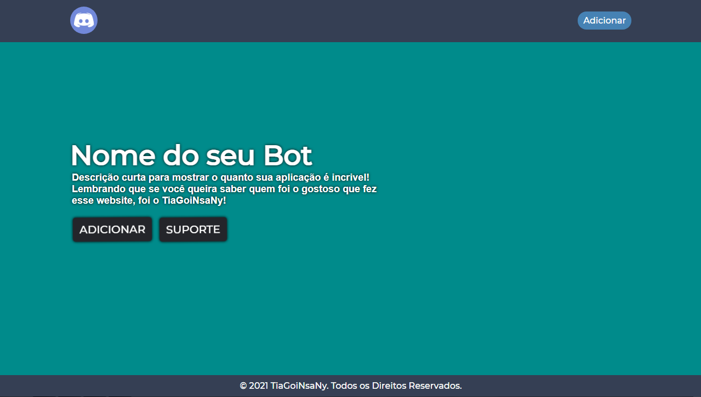

# :tv: WEBSITE SIMPLES PARA BOTS DISCORD

## `1º` **|** Introdução:

E sempre melhor para sua aplicação ter um website para mostrar aqueles botões simples de adicionar e de suporte, pensando nisso eu desenvolvi um website simples para você customizar e usar na sua hospedagem. Lembrando que esse website tem responsividade, então não se preocupe ao vizualizar o seu website pelo computador ou celular.

<br 

## `2º` **|** Linguagens usadas:

O projeto foi desenvolvido apenas com 2 linguagens, o **HTML5** e **CSS3**, então não se preocupe em entender outras linguagens e perder tempo batendo cabeça!

## `3º` **|** Links:

- [Meu Twitter](https://twitter.com/TiaGoiNsaNy)

## `4º` **|** Autor:

| [ @TiaGoiNsaNy](https://github.com/TiaGoiNsaNy) |
| :---: | 
